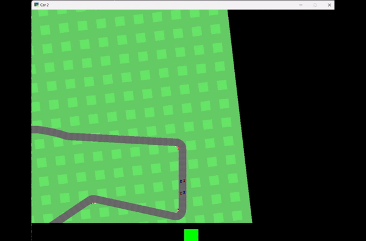

# Learning to Communicate in Multi-Agent Semi-Adversarial Environments

<p>
    
    
</p>
<p>
    
    
</p>

## Overview
This is a project repo for fa24 cs8803-DRL in Gatech. 
This project is based on the concepts presented in the paper [Emergent Coordination Through Competition](https://openreview.net/pdf?id=BkG8sjR5Km) and use this [repo](https://github.com/DomenicoMeconi/MultiCarRacing-ReinforcementLearning.git) as a code base.

## Installation

1. **Install And Set Up The Environment:**
    ```bash
    conda create -n car python=3.8
    ```

2. **Install Dependencies:**
    In case there are issues with the environment installation, especially with `Box-2D`, try to install:
    ```bash
    pip install shapely
    ```

3. **Install Required Packages:**
    ```bash
    pip install -r requirements.txt
    ```

## Usage

After successfully installing the required packages, you can run the main script with different arguments:

- To **train the model**:
    ```bash
    python .\main -t
    ```

- To **resume training from a checkpoint**:
    ```bash
    python .\main -t -c
    ```

- To **evaluate the best models**:
    ```bash
    python .\main -e
    ```

- To **evaluate on a checkpoint**:
    ```bash
    python .\main -e -c
    ```

