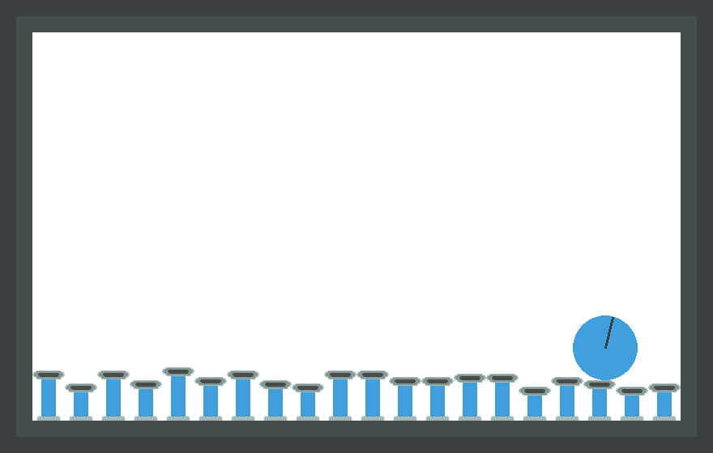
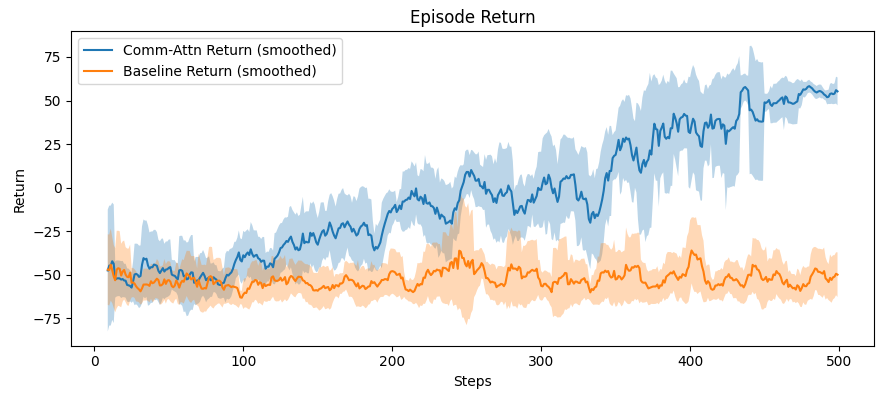

# Comm-Adv-Racing

<div style="display: flex; justify-content: space-around;">
  <div style="text-align: center;">
    
    <p>wo communication</p>
  </div>
  <div style="text-align: center;">
    
    <p>w communication</p>
  </div>
</div>


This repository contains the implementation of a reinforcement learning algorithm for the Pistonball environment using Proximal Policy Optimization (PPO) with communication between agents. The goal is to investigate how communication between agents influences their performance in individual tasks. Experiments have shown communication has made the context richer and enabled more beneficial interactions in semi-adversarial and cooperative situations.



## Setup

1. Clone the repository:

   ```sh
   git clone https://github.com/Cassie-LIm/Comm-Adv-Racing.git
   cd Comm-Adv-Racing
   ```

2. Installation:

    To create env:

    ```
    python3.9 -m venv env
    source env/bin/activate
    pip install -r requirements.txt
    ```
    For conda user:
    ```
    conda create --name car python=3.9
    conda activate car
    pip install -r requirements.txt
    ```


## Usage

### Training

To train the agents, run the `train.py` script. You can specify various options using command-line arguments:

```sh
python train.py --communicate_actions --render --neighbor_range 2
```

- `--communicate_actions`: Enable communication between agents.
- `--render`: Render the environment during training.
- `--neighbor_range`: Set the range of neighbors for communication. If set to None, communicate across all agents.

### Visualization

To visualize the training progress and attention weights, use the `plot.py` and `viz_attn.py` scripts. 

#### Plotting Training Metrics

To plot the training metrics, run the `plot.py` script. Please specify the log dirs in this file:

```sh
python plot.py
```

#### Visualizing Attention Weights

To visualize the attention weights, run the `viz_attn.py` script. You might need to specify the path to the weight in this file:

```sh
python viz_attn.py
```

### Rendering and Saving GIFs

To render the trained policy and save the result as a GIF, use the `render_and_save_gif` function from `utils.py`. This function can be called from the training script or separately:

```python
from utils import render_and_save_gif
from agent import Agent
from pettingzoo.butterfly import pistonball_v6
from supersuit import color_reduction_v0, frame_stack_v1, resize_v1

# Set up the environment
env = pistonball_v6.parallel_env(render_mode="rgb_array", continuous=False)
env = color_reduction_v0(env)
env = resize_v1(env, 64, 64)
env = frame_stack_v1(env, stack_size=4)

# Load the agent
model_path = "models/YOUR_MODEL_PATH"  # Replace with your model path
checkpoint = torch.load(model_path)
num_actions = env.action_space(env.possible_agents[0]).n
agent = Agent(num_actions=num_actions).to(device)
agent.load_state_dict(checkpoint['agent_state_dict'])

# Render and save GIF
render_and_save_gif(env, agent, gif_path="rendered_episode.gif")
print(info)
```

## Folder Structure

```
Comm-Adv-Racing/
├── agent.py                # Defines the agent and communication mechanism
├── train.py                # Training script for the PPO algorithm
├── plot.py                 # Script for plotting training metrics
├── viz_attn.py             # Script for visualizing attention weights
├── utils.py                # Utility functions for rendering and saving GIFs
└── requirements.txt        # List of required packages
```
